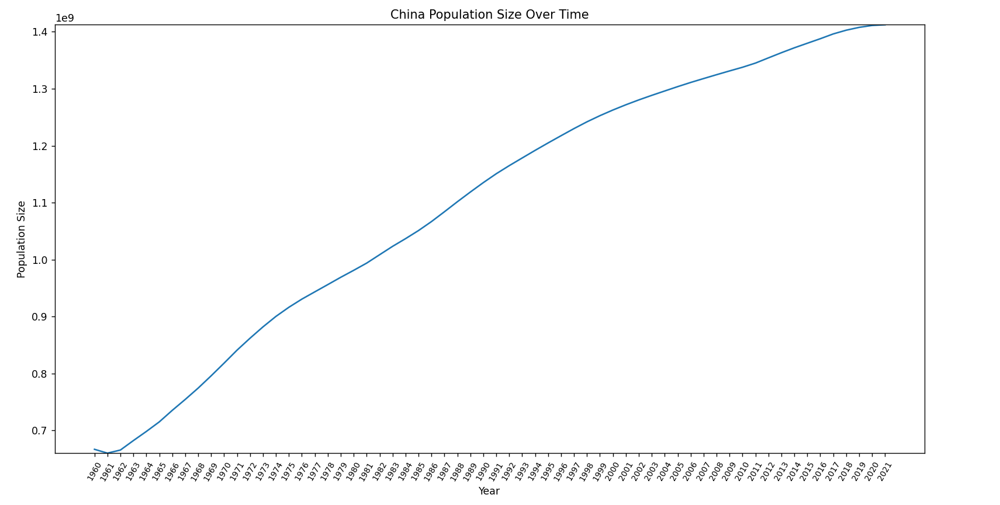
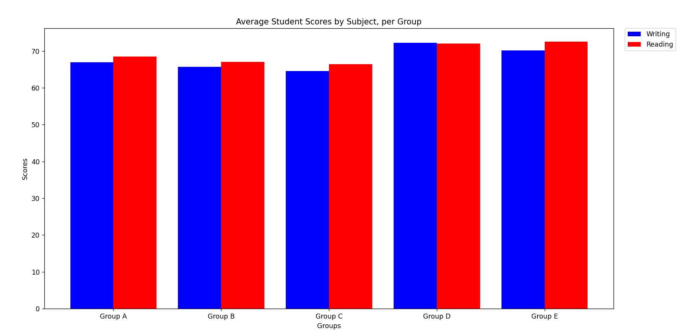

# [Project 2](https://github.com/mikeizbicki/cmc-csci040/tree/2022fall/project_02) for CM-CSCI 40.

## China's Population Size Over Time

The dataset can be found [here](http://api.worldbank.org/v2/countries/CHN/indicators/SP.POP.TOTL?per_page=5000&format=json)

## Average Student Scores by Subject, per Group

The dataset can be found [here](https://www.kaggle.com/datasets/whenamancodes/students-performance-in-exams)
