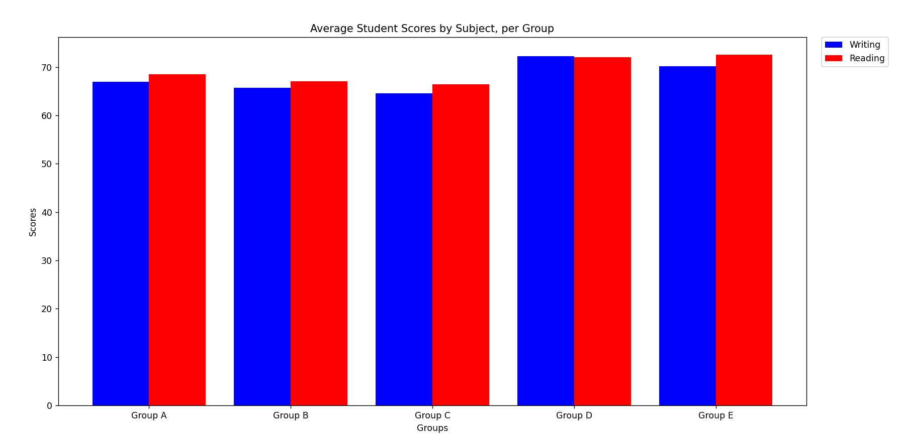

# [Project 2](https://github.com/mikeizbicki/cmc-csci040/tree/2022fall/project_02) for CM-CSCI 40.

## China's Population Size Over Time

This data shows the change in China's population size over the years. Aside from a small dip in 1961, we can see that China's population has been consistently rising over the years. It's kind of crazy to think that they hit 1 billion in the early 1980s. 

The dataset that I used to plot this graph from can be found [here](http://api.worldbank.org/v2/countries/CHN/indicators/SP.POP.TOTL?per_page=5000&format=json).

## Average Student Scores by Subject, per Group

This dataset showed the scores of students across various disciplines such as writing, reading, and math. It also offered a plethora of additional information about the students, such as their race, their parental's level of education, and whether or not they completed a test preparation course or not. I chose to focus on race (which was documented with groups A-E) and how they did on writing and reading tests.

The dataset that I used to plot this graph can be found [here](https://www.kaggle.com/datasets/whenamancodes/students-performance-in-exams).
